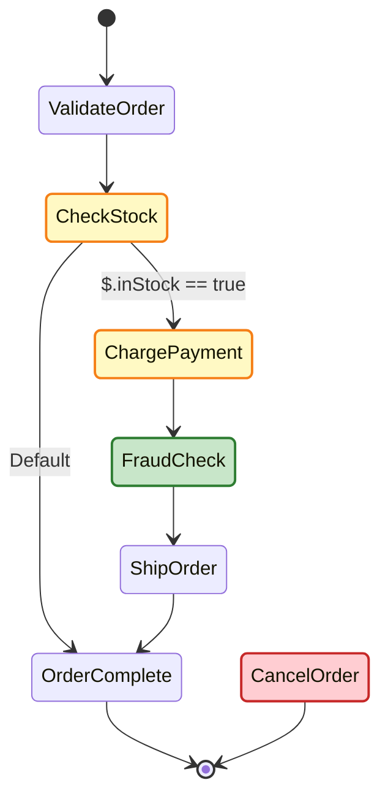

# Step Functions Diagram Preview

[](https://github.com/marketplace/actions/step-functions-diagram-preview)
[](https://opensource.org/licenses/MIT)

Comment an **AWS Step Functions diagram** on every pull request that touches an ASL file — with the changes highlighted inline.

On each PR the action finds changed ASL files, compares the base and head revisions, and posts (or updates) a single comment containing:

- a per-file **added / modified / removed** summary table, and
- a **Mermaid diagram** in which changed states are colour-highlighted — **added = green, modified = yellow, removed = red** — rendered natively by GitHub, so there are no images to host.

Built on the [`sfn-diagram`](https://www.npmjs.com/package/sfn-diagram) library (`generateMermaidDiff`).

## Example

A PR that adds a `FraudCheck` step, changes `ChargePayment`, and removes `CancelOrder` gets a comment like this:



## Usage

```yaml
# .github/workflows/sfn-preview.yml
name: Step Functions Preview
on:
  pull_request:
    paths: ['**/*.asl.json', '**/*.asl']

permissions:
  contents: read
  pull-requests: write   # required to post the comment

jobs:
  preview:
    runs-on: ubuntu-latest
    steps:
      - uses: actions/checkout@v5
        with:
          fetch-depth: 0        # needed to diff base vs head
      - uses: yusufaf/sfn-diagram-action@v1
```

Pin to the moving major tag `@v1` (recommended) or an exact release like `@v1.0.0`.

## Inputs

| Input | Default | Description |
| --- | --- | --- |
| `github-token` | `${{ github.token }}` | Token used to post/update the PR comment |
| `asl-glob` | `**/*.asl.json,**/*.asl` | Comma-separated glob patterns matching ASL files |
| `comment-tag` | `sfn-diagram-preview` | Marker used to find and update an existing comment |

## Notes

- Runs only on `pull_request` events; on other events it no-ops.
- **New** files show a plain diagram, **deleted** files show the last diagram, **changed** files show the highlighted diff.
- The comment is upserted — one comment per PR, updated on each push.

## Source

This repository is the standalone, Marketplace-published build of the action. Development happens in the [`sfn-diagram` monorepo](https://github.com/yusufaf/sfn-diagram) under [`packages/github-action-sfn-diagram`](https://github.com/yusufaf/sfn-diagram/tree/main/packages/github-action-sfn-diagram); the bundled `action.yml` + `dist/` here are synced from it on each release.

## License

MIT — see [LICENSE](LICENSE).
